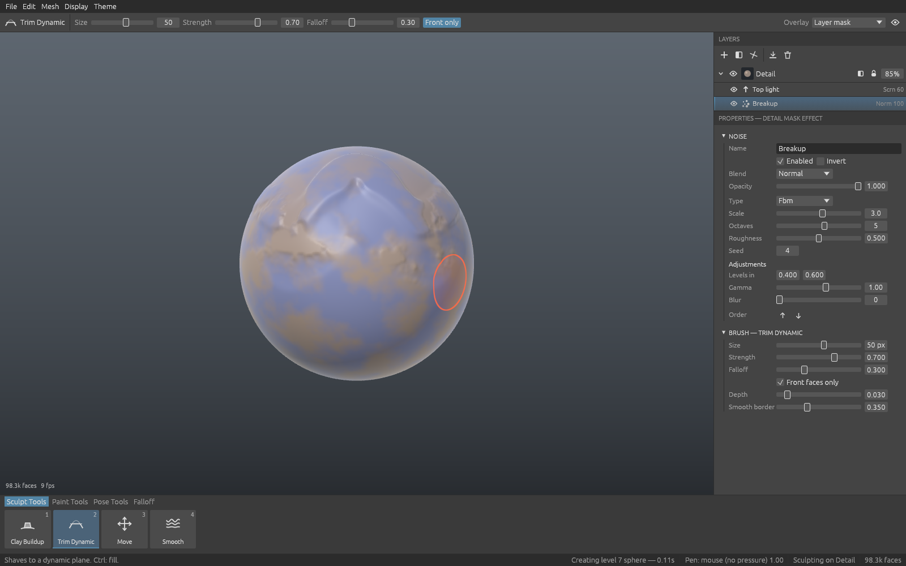
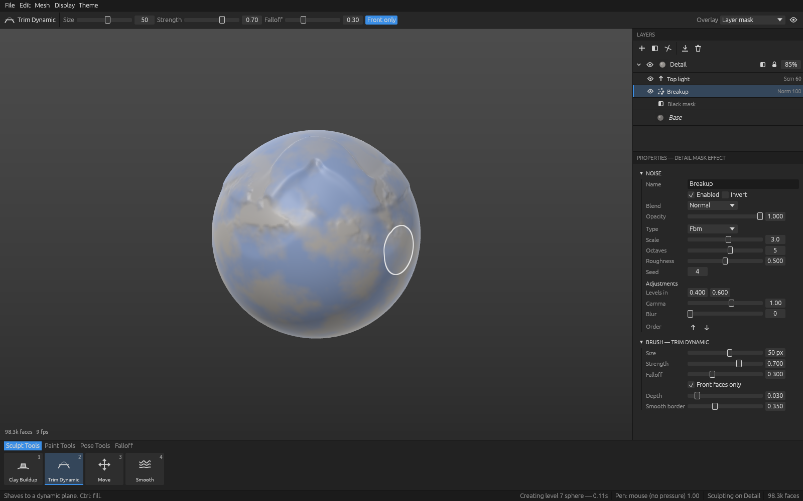
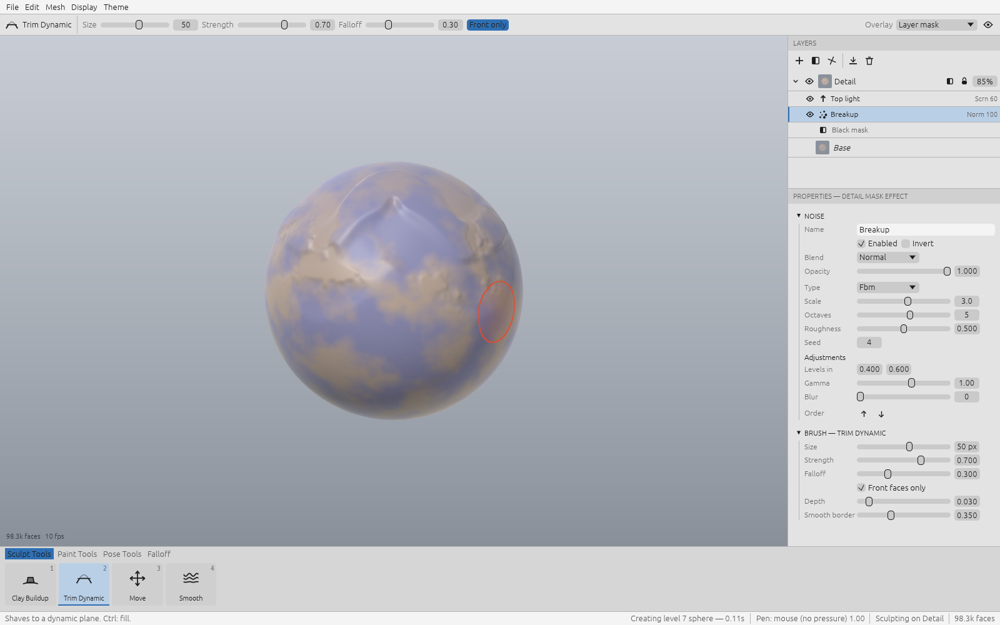
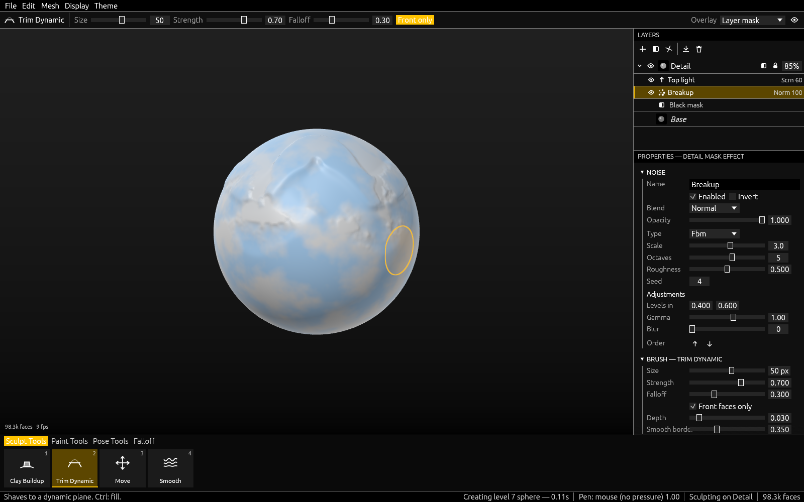

# Sculpt

A digital sculpting engine with Mudbox's workflow and ZBrush's density and brush
feel: sculpt layers with strength sliders and masks, freeze, Clay Buildup / Trim
Dynamic / Move / Smooth brushes, topological posing, Substance-style mask stacks
(procedural noise + hand painting + curvature/AO/thickness bakes) and a
data-driven layered project format.


*`sculpt-cli demo`: topological Move, Clay Buildup, Trim Dynamic and a posed bump; right panel shows the detail layer's mask (fbm noise ⊕ hand paint − cavity).*

See [`docs/ARCHITECTURE.md`](docs/ARCHITECTURE.md) for the design, measured
performance and roadmap.

```
crates/sculpt-core   engine library (no UI, no GPU dependency)
crates/sculpt-app    the desktop app: egui + wgpu, Mudbox-style, themeable
crates/sculpt-cli    demo / benchmark / project tools / thumbnail renderer
docs/                architecture, roadmap, screenshots
```

## The app



```sh
cargo run --release -p sculpt-app                        # level-7 sphere (98k faces)
cargo run --release -p sculpt-app -- --level 9           # 1.6M faces
cargo run --release -p sculpt-app -- path/to/head.sculpt # open a project
cargo run --release -p sculpt-app --features tablet      # + octotablet pen pressure (Windows Ink / Wayland)
```

| Input | Action |
|---|---|
| LMB drag | sculpt / paint with the current tool |
| Shift + stroke | Smooth · Ctrl + stroke: invert (dig, fill, unfreeze, erase) |
| Alt + LMB, or RMB drag | orbit |
| Alt + MMB, or MMB drag | pan |
| Alt + RMB drag, or wheel | zoom |
| `1`–`7` | Clay Buildup, Trim Dynamic, Move, Smooth, Freeze, Mask Paint, Pose |
| `[` `]` / Shift+`[` `]` | brush size / strength |
| `F` frame · `Shift+D` subdivide · `Ctrl+L` new layer · `O` cycle overlay · `H` HUD | |

Everything above is data: **themes** are JSON files (built-ins in
`crates/sculpt-app/themes/`; your own go in `~/.config/sculpt/themes/` and
hot-reload on save, or use *Display ▸ Theme editor*), and **hotkeys** are
overridden per command in `~/.config/sculpt/keymap.json` (same format as
`crates/sculpt-app/keymap.json`). Set `SCULPT_HOME` to relocate the config folder.

The layout is a Substance Painter / Mudbox hybrid:

- **Context toolbar** above the viewport (Painter): current tool, size, strength, falloff, front-faces, overlay.
- **LAYERS** (right): sculpt layers with eye / lock / inline strength, and each layer's mask effects
  nested beneath it (Paint, Fill, Noise, Curvature, Cavity, AO, Thickness, Direction, Gradient).
  Double-click to rename; the toolbar adds layers, masks and effects, flattens and deletes.
- **PROPERTIES** (right, below): edits whatever is selected (layer, mask or effect), then the brush.
  Selecting a Paint effect makes Mask Paint draw into it.
- **Tray** (bottom, Mudbox): Sculpt / Paint / Pose tools and a Falloff tray of curve presets.

| Painter Dark | Studio Light | High Contrast |
|---|---|---|
|  |  |  |

### Measuring it on your machine

The HUD (top-left, `H`) shows fps, CPU time for input+dabs and the viewport,
bytes uploaded to the GPU per frame, and which **pen source** is live with the
current pressure. For a repeatable number, run the built-in stroke test — it
pushes synthetic 240 Hz pen strokes through the real input → dab → upload →
render path and prints percentiles:

```sh
cargo run --release -p sculpt-app -- --level 10 --test-strokes 180 --screenshot test.png
```

## Build & run

```sh
cargo test --release                       # engine tests
cargo run --release -p sculpt-cli -- demo out   # scripted session -> out/demo.sculpt, OBJs, demo.png
cargo run --release -p sculpt-cli -- bench 9    # brush latency at 1.5M faces (10 = 6.3M)
cargo run --release -p sculpt-cli -- info out/demo.sculpt
cargo run --release -p sculpt-cli -- render out/demo.sculpt out/view.png
cargo run --release -p sculpt-cli -- import-channel out/demo.sculpt paint.ext values.csv
```

## Using the engine

```rust
use sculpt_core::{Document, brush::{self, BrushSettings, ClayBuildup}, primitives::quad_sphere};
use sculpt_core::mask::{MaskStack, MaskLayer, MaskSource};
use sculpt_core::noise::NoiseParams;

let mut doc = Document::from_mesh(quad_sphere(6, 1.0))?;
let detail = doc.add_layer("Detail");                       // becomes the active layer
brush::stroke(&mut doc, &mut ClayBuildup::default(), &BrushSettings::default(), &path)?;
doc.set_layer_opacity(detail, 0.6)?;                        // strength slider
doc.set_layer_mask(detail, Some(MaskStack::new(0.0)
    .with(MaskLayer::new("noise", MaskSource::Noise(NoiseParams::default())))))?;
sculpt_core::io::project::save(&doc, "head.sculpt".as_ref())?;
```
