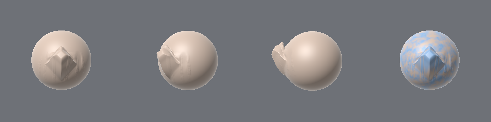

# Sculpt

A digital sculpting engine with Mudbox's workflow and ZBrush's density and brush
feel: sculpt layers with strength sliders and masks, freeze, Clay Buildup / Trim
Dynamic / Move / Smooth brushes, topological posing, Substance-style mask stacks
(procedural noise + hand painting + curvature/AO/thickness bakes) and a
data-driven layered project format.



*`sculpt-cli demo`: topological Move, Clay Buildup, Trim Dynamic and a posed bump; right panel shows the detail layer's mask (fbm noise ⊕ hand paint − cavity).*

This is the headless engine core plus a CLI. The GPU viewport and Mudbox-style
UI are the next phase — see [`docs/ARCHITECTURE.md`](docs/ARCHITECTURE.md) for
the design, measured performance and roadmap.

```
crates/sculpt-core   engine library (no UI, no GPU dependency)
crates/sculpt-cli    demo / benchmark / project tools / thumbnail renderer
docs/                architecture and roadmap
```

## Build & run

```sh
cargo test --release                       # engine tests
cargo run --release -p sculpt-cli -- demo out   # scripted session -> out/demo.sculpt, OBJs, demo.png
cargo run --release -p sculpt-cli -- bench 9    # brush latency at 1.5M faces (10 = 6.3M)
cargo run --release -p sculpt-cli -- info out/demo.sculpt
cargo run --release -p sculpt-cli -- render out/demo.sculpt out/view.png
cargo run --release -p sculpt-cli -- import-channel out/demo.sculpt paint.ext values.csv
```

## Using the engine

```rust
use sculpt_core::{Document, brush::{self, BrushSettings, ClayBuildup}, primitives::quad_sphere};
use sculpt_core::mask::{MaskStack, MaskLayer, MaskSource};
use sculpt_core::noise::NoiseParams;

let mut doc = Document::from_mesh(quad_sphere(6, 1.0))?;
let detail = doc.add_layer("Detail");                       // becomes the active layer
brush::stroke(&mut doc, &mut ClayBuildup::default(), &BrushSettings::default(), &path)?;
doc.set_layer_opacity(detail, 0.6)?;                        // strength slider
doc.set_layer_mask(detail, Some(MaskStack::new(0.0)
    .with(MaskLayer::new("noise", MaskSource::Noise(NoiseParams::default())))))?;
sculpt_core::io::project::save(&doc, "head.sculpt".as_ref())?;
```
